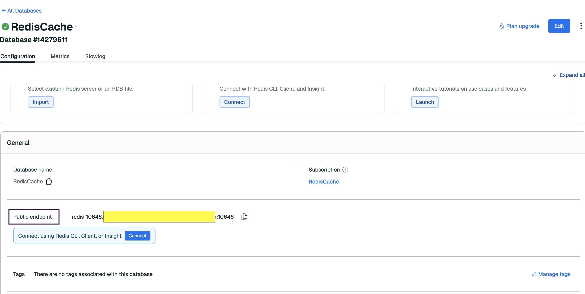
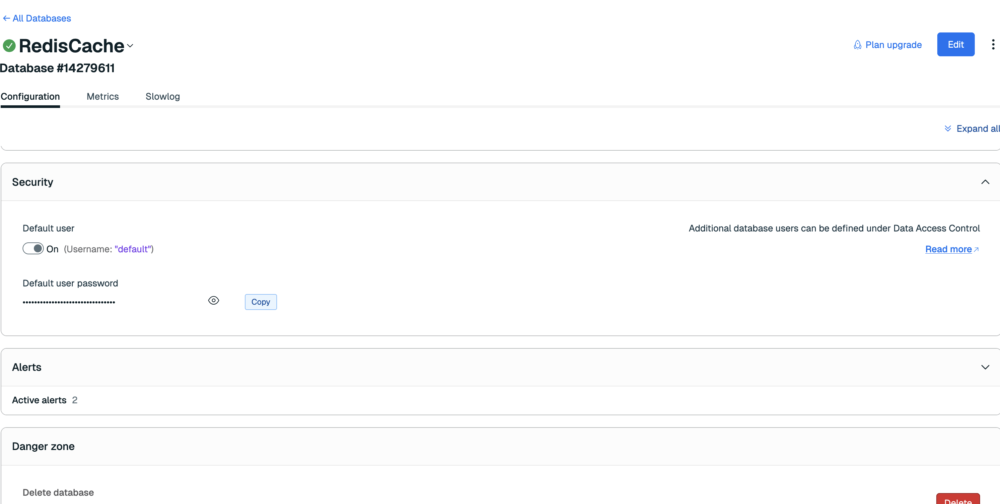

# Project: Spring Boot Cache Example

Short Java Spring Boot project demonstrating Redis caching with SQL persistence.

## Tech stack
1. Java (`21`)
2. Spring Boot
3. Redis (Spring Data Redis)
4. SQL database (MySQL)
5. Gradle

## Project structure (important files)
1. `src/main/java/com/learning/cache` — application code
2. `src/main/java/com/learning/cache/config/RedisConfig.java` — Redis cache configuration
3. `src/main/resources/application.properties` — runtime configuration
4. `build.gradle` / `settings.gradle` — Gradle build files
5. `src/test/java` — unit / integration tests

## Prerequisites (macOS)
1. JDK `21` or newer
2. Gradle wrapper (use `./gradlew`)
3. Redis server (Redis Cloud or local Redis)
4. Database (MySQL) or use an in-memory DB for quick testing
5. IntelliJ IDEA (`2025.1.4.1`)

## Configuration
Place runtime properties in `src/main/resources/application.properties`.

Example `application.properties`:
~~~properties
spring.datasource.url=jdbc:mysql://localhost:3306/mydb
spring.datasource.username=dbuser
spring.datasource.password=dbpass
spring.datasource.driver-class-name=com.mysql.cj.jdbc.Driver

spring.redis.host=localhost
spring.redis.port=6379

spring.jpa.hibernate.ddl-auto=update
spring.jpa.show-sql=true
~~~

## Redis setup

### Redis Cloud
1. Create or sign in to a Redis Cloud account.
2. Create a database instance and note host, port and password.
3. Host and port would be present in `Public endpoint`, use those values in `application.properties`.

4. Password would be present in `Security` tab of the database instance.

5. Use the provided public endpoint and credentials in `application.properties`.

### Local Redis (Homebrew)
Install and start:
~~~bash
brew install redis
brew services start redis
~~~
Verify:
~~~bash
brew services info redis
redis-cli ping
# expected: PONG
~~~
Documentation: https://redis.io/docs/latest/

## Run DB in Docker (MySQL)
1. Ensure Docker is running.
2. Start DB:
~~~bash
docker-compose up -d
~~~
3. Default credentials from the compose file (adjust as needed):
~~~   
username: root 
password: password
~~~

## Build and run
1. Build:
~~~bash
./gradlew clean build
~~~
2. Run:
~~~bash
./gradlew bootRun
~~~
3. Package:
~~~bash
./gradlew bootJar
java -jar build/libs/<project>.jar
~~~
Use IntelliJ: import Gradle project and run the main Spring Boot application or the `bootRun` task.

## Tests
Run unit tests:
~~~bash
./gradlew test
~~~
Run single test classes from IntelliJ using gutter run actions.

## Caching notes (from `RedisConfig.java`)
1. TTL is set to 30 seconds (entry time-to-live).
2. Time-to-idle is enabled so each access resets the idle timer.
3. Keys are serialized with `StringRedisSerializer`.
4. Values commonly use `GenericJacksonJsonRedisSerializer` for JSON — enable/configure as needed.
5. Debug checklist:
   - Verify `spring.redis.host`, `spring.redis.port` and password.
   - Confirm cache names used by annotations match configured names.
   - Inspect Redis keys/values with `redis-cli`.

## Common Gradle commands
- Build: `./gradlew build`
- Run: `./gradlew bootRun`
- Tests: `./gradlew test`
- Clean: `./gradlew clean`

## Troubleshooting
1. Redis connection refused: ensure Redis is running and credentials are correct.
2. Serialization issues: configure a consistent value serializer.
3. DB connectivity: check JDBC URL, user, password, and network access.

## Useful files to check
1. `src/main/java/com/learning/cache/config/RedisConfig.java`
2. `src/main/resources/application.properties`
3. `src/main/java/com/learning/cache/main/profile/service/ProfileService.java` (where caching is applied)
4. `build.gradle`

## Caching annotations (brief)

- `@EnableCaching`  
  Enables Spring's annotation-driven cache management. Add to the main application or a configuration class:
~~~java
@Configuration
@EnableCaching
public class RedisConfig { ... }
~~~

- `@Cacheable`  
  Caches method return values. If a cached value exists for the given key, the method is not executed.
~~~java
@Cacheable(value = "profiles", key = "#id")
public Profile findById(Long id) { ... }
~~~
Notes: use `unless` to skip caching conditionally; use `sync = true` to reduce cache stampede.

- `@CachePut`  
  Always executes the method and updates the cache with the returned value (useful for create/update).
~~~java
@CachePut(value = "profiles", key = "#result.id")
public Profile save(Profile p) { ... }
~~~

- `@CacheEvict`  
  Removes entries from the cache (useful for deletes or invalidation).
~~~java
@CacheEvict(value = "profiles", key = "#id")
public void delete(Long id) { ... }
~~~
Notes: `allEntries = true` clears the entire cache; `beforeInvocation = true` evicts even if the method throws.

General: ensure cache names match configuration in `RedisConfig.java` and choose keys consistently (method parameters, `#result`, or a custom key generator).

## License
Project code: proprietary / internal (update as needed).